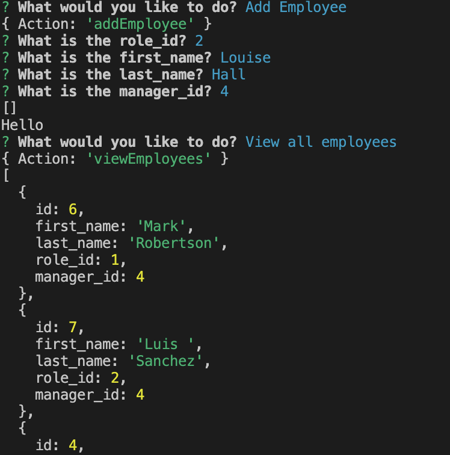

# Employee Database System
  
 
  ## table of contents 
  *  [Description](#description)
  *  [Installation](#installation)
  *  [Usage](#usage)
  *  [Questions](#questions)
  *  [License](#license)
    
  
## Description
My motivation to create this project was to make a to create content management system for data I want to collect node. I built this project to create a streamlined way to record content data. This site solves the problem of not having an application to store and create employee data. I learned how to use SQL to create this application.

## Deployed Site

This is a node application and it is accessible on the command line.

## Installation

To install the project, pull the code from https://github.com/stefanfilm/employeedatasystem and open it in a code editor. Open the index.js in the code editor and view the JavaScript. Create a package.json and run npm init. Answer the questions. Install Inquirer. 

## Usage

Navigate to the directory in the code editor and go to the command line. Type in node server.js. Answer the prompts. It will create an employee database. Here is a link to the video walkthrough. https://www.youtube.com/watch?v=BssrA6RtJVo


    ```md
    
    ```


  ## License
  This project is licensed with the MIT license.
  

  ## Contributions
  Self. This project was made under the instruction of Mark Carlson in the UC Berkeley Software Development Bootcamp.

  ## Questions
  You can contact me at stefan.wanigatunga@gmail.com
  My GitHub Username is stefanfilm